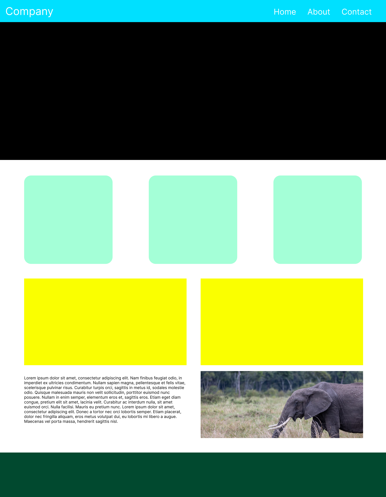

# HTML/CSS Project

## Steps

1. Fork the repo
2. clone it down to your machine
3. Create an `index.html` file
4. use the `!` shortcut to generate the boilerplate
5. Link the `reset.css` file to your html file
6. create your own `main.css` file and link it to your html file
7. Attempt to copy the layout below

